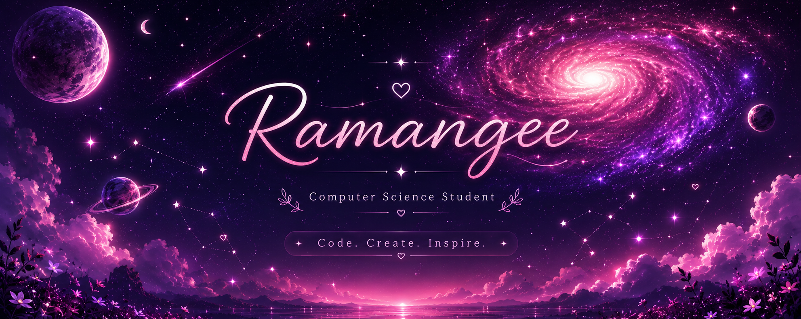
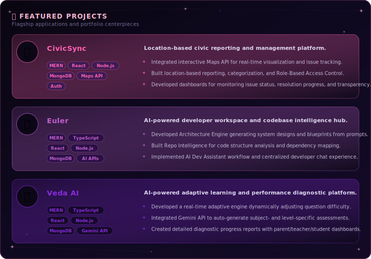
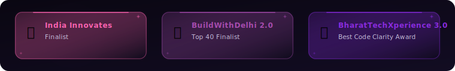

  

 

  

  
  
  
  

---

### 🌸 About Me

I am a B.Tech Computer Science and Engineering student entering my 5th semester. I love turning ideas into impactful digital experiences and building tech that is beautiful, functional, and meaningful.

<table>
  <tr>
    <td width="50%" valign="top">
      <h4>💡 What Drives Me</h4>
      <ul>
        <li><strong>Building Cool Tech:</strong> Solving real-world problems with software</li>
        <li><strong>Immersive Environments:</strong> Designing AR/VR & spatial computing applications</li>
        <li><strong>Aesthetic & Fluid UIs:</strong> Creating polished, user-centered interfaces</li>
        <li><strong>Continuous Growth:</strong> Learning new paradigms and building daily</li>
      </ul>
    </td>
    <td width="50%" valign="top">
      <h4>🚀 Currently Exploring</h4>
      <ul>
        <li><strong>Advanced DSA:</strong> Refining problem-solving & algorithmic skills</li>
        <li><strong>Machine Learning:</strong> Diving into intelligent system integrations</li>
        <li><strong>AR/VR Development:</strong> Interactive 3D assets & experiences</li>
        <li><strong>System Design:</strong> Designing robust and scalable backends</li>
      </ul>
    </td>
  </tr>
</table>

---

### 🛠️ Tech Stack

  

---

### ✨ Featured Projects

  

---

### 🏆 Achievements

  

---

### 🌿 Contribution Garden

  
<em>"Every contribution helps the garden grow."</em>

  
   
  "Consistency is the seed. Discipline is the water. Growth is inevitable."

---

### 🌸 Most Used Languages

  

---

  Building the future, one commit at a time. ♡

